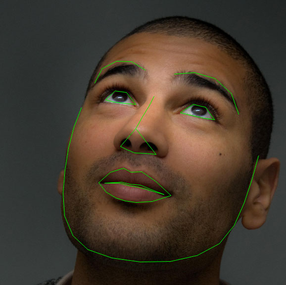

# Facial landmarks Detection using dlib, OpenCV, and Python

<h1>Facial landmarks are used to localize and represent salient regions of the face, such as: </h1>
<ul>
<li> <h2>Eyes </h2></li>
<li> <h2>Eyebrows </h2></li>
<li><h2>Nose </h2> </li>
<li> <h2> Mouth</h2></li>
<li> <h2>Jawline </h2></li>
</ul>

## What are facial landmarks?

<h2 >Detecting facial landmarks is a subset of the shape prediction problem. Given an input image (and normally an ROI that specifies the object of interest), a shape predictor attempts to localize key points of interest along the shape. </h2>
 

 ## Understanding dlib’s facial landmark detector
 <h2> The pre-trained facial landmark detector inside the dlib library is used to estimate the location of 68 (x, y)-coordinates that map to facial structures on the face.

The indexes of the 68 coordinates can be visualized on the image below:</h2>

<h2> These annotations are part of the 68 point iBUG 300-W dataset which the dlib facial landmark predictor was trained on.

It’s important to note that other flavors of facial landmark detectors exist, including the 194 point model that can be trained on the HELEN dataset.

Regardless of which dataset is used, the same dlib framework can be leveraged to train a shape predictor on the input training data — this is useful if you would like to train facial landmark detectors or custom shape predictors of your own.</h2>
